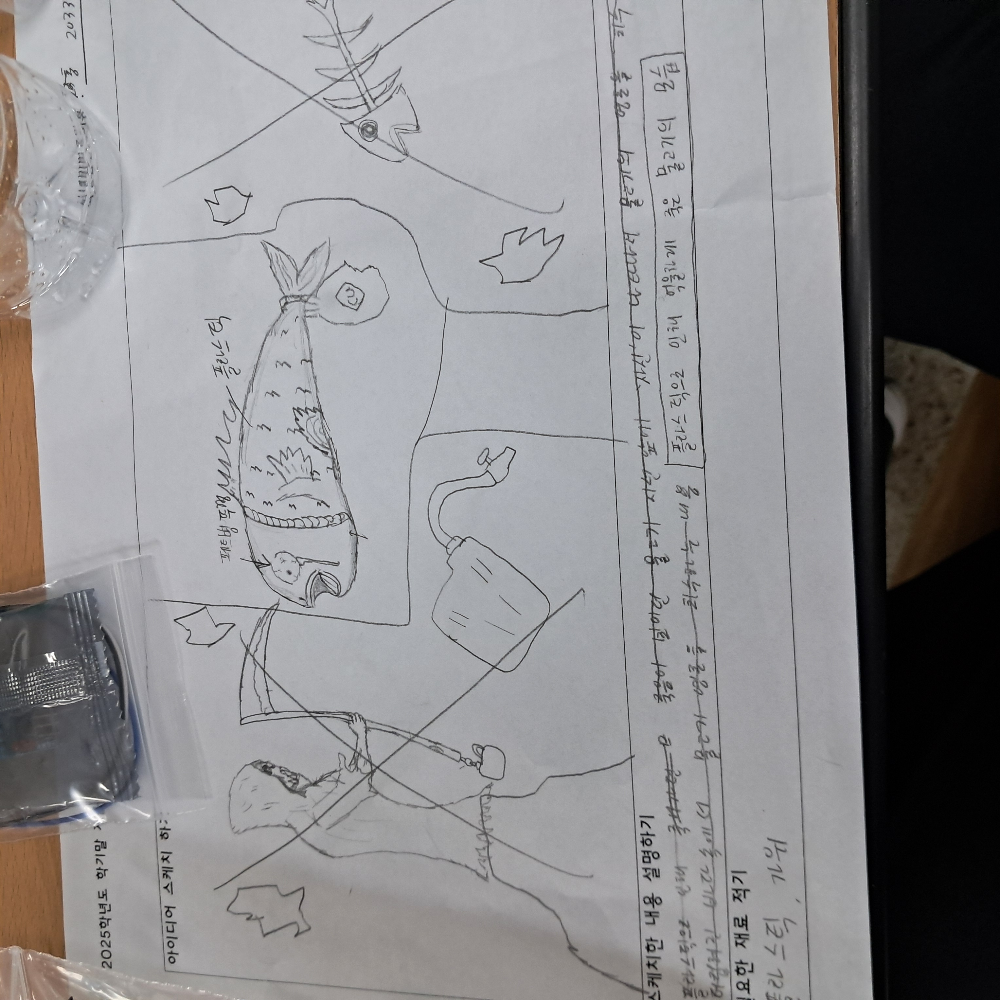
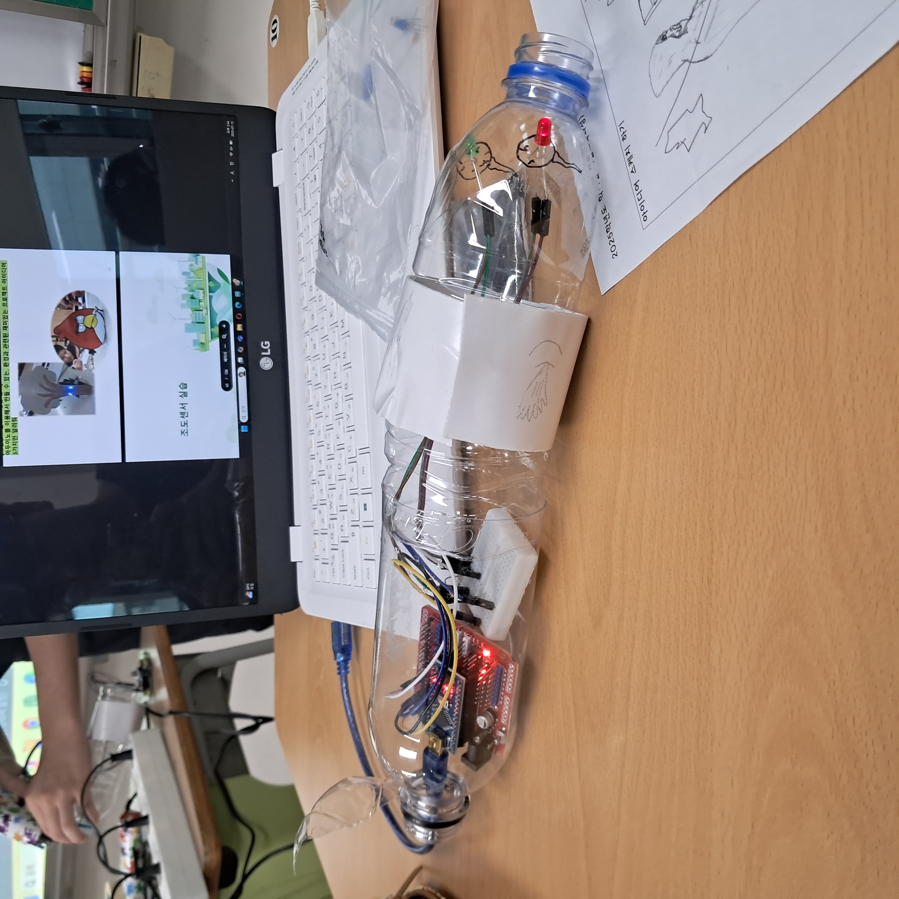

# 🌱 에코아트 프로젝트: 플라스틱으로 인해 억울하게 죽은 물고기

## 📖 프로젝트 개요
- **제작자**: 홍성모
- **제작일**: 7/14~7/16
- **소개**
> 제가 만든 이 작품의 의도로는 우리가 버리는 플라스틱이 바닷속에 버려져 버려진 플라스틱으로 인해 억울하게 죽은 물고기가 많다는걸 사람들이 보고 많은 생각이 들게하는 의도로 만들어졌고
> 제 작품애 눈으로 표현된 LED의 의미는 하나씩 따로 았습니다 하나 '슬픔(빨간색)'을 의미하고 둘 '살고싶다(초록색)'이라는 의미를 가집니다.

## 📦 사용 재료
- 아두이노, LED, 브레드보드
- 페트병

## 🔧 제작 과정

### 1단계: 아이디어 스케치

-아이디어 설명:제가 스케치한 아이디어는 사람들이 고통스럽고 억울하게 죽은 물고기를 보고 많은 생각을 들게 하는 의도로 스케치했습니다.
-완성도:다 완성됬다
### 2단계: 완성품

## 💭 제작 후기
### 잘된 점
- 제가 만든 작품으로 통해서 이 작품과같은 상태의 물고기를 알리는게 잘 된 점이라고 생각합니다.

### 아쉬운 점
- 제가 스케치했던 그림과는 몇부분이 달라진게 아쉽습니다.

### 개선할 점
- 

### 내가 이미 알고 있었던 것
- 플라스틱이 바닷속에 버려진것과 그 플라스틱의 영향으로 몇몇의 해양생물이 멸종위기에 처하고 그 외에 많은 해양생물들이 죽었다는 점을 이미 알고있습니다.

### 새롭게 배운게 된 것
- 첫번쨰 수업에서 영상을 봤을때 실제 바닷속이 얼마나 오염됬는지에 대해 알 수 있었고 그리고 몰랐던 '아두이노'에 대해 알게 되었습니다.

### 더 알고 싶은 것
- 

## 🌍 환경적 의미
- 제가 만든 작품은 사람들이 더이상 물고기들이 고통스럽게 하지않도록 노력하게 만드는 영향이 있다고 저는 생각합니다.
-앞으로 환경을 위해 노력할 점은 플라스틱 사용량을 줄이는데 노력하는 것입니다 많은 해양생물들의 계체수가 줄여지는것을 막기 위함으로요.
## 📚 참고 자료
- [환경 관련 웹사이트](링크)
- [참고한 에코아트 작품](링크)

## 🏷️ 태그
#에코아트 #재활용 #환경보호 #DIY #창의활동

---

> 이 프로젝트는 환경 보호와 창의적 사고를 위한 교육 목적으로 제작되었습니다.
